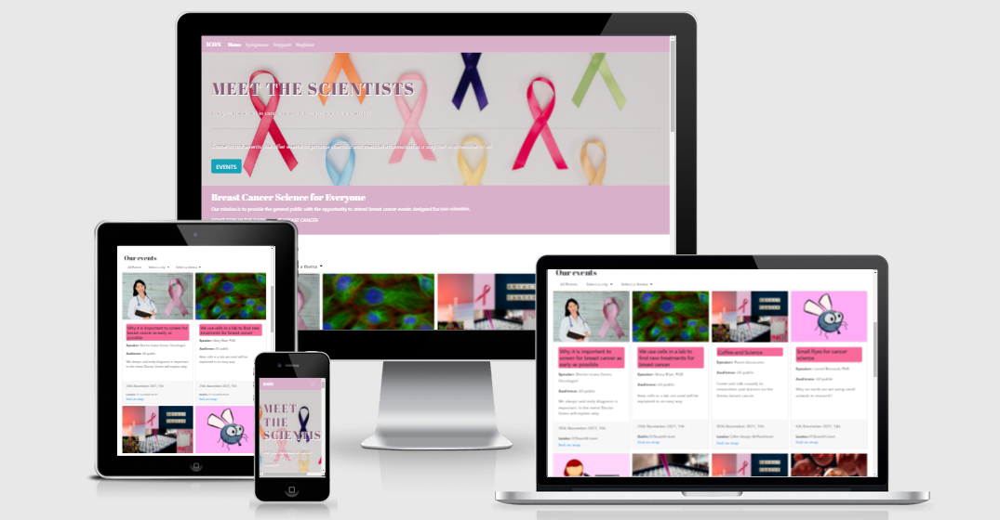
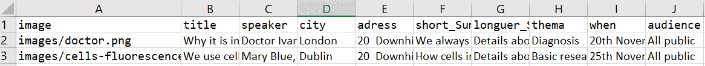

<h1 align="center">Hackathon Breast Cancer Awareness - MEET THE SCIENTISTS</h1>

# Title 
[Live project here.](https://laurepiechaczyk.github.io/Hackathon-nov-21/)

<h3 align="center"></h3>

## Project realised by : 
Shoshie-coding, irenenev24, mcglasp, LaurePiechaczyk 

## About 
Welcome to MEET THE SCIENTISTS

The website offers the general public the opportunity to attend breast cancer events designed for them.
It also provides information the signs and symptoms of breast cancer and how to find support groups.

## Background
Basic science and research can be very intimidating for non-scientists. The vocabulary is very specific and the experiments done in a laboratory are not always understandable to the general public.

Yet medical research is done for patients, with the aim of improving their lives.

So how can we bridge the gap between research and patients and enable better communication?

The aim of this website is to help the general public to better understand breast cancer, basic cancer research and to facilitate communication between researchers and patients, patients' families or anyone interested in the subject.

## Target audience
General public interested in breast cancer research, and in particular patients and families of breast cancer patients.

## UXD

### Goals

The site is designed to offer the general public the opportunity to attend events specifically designed for them (not for scientists). The aim is to give the general public the desire and opportunity to meet researchers and participate in research-related events. 

For this project, the events were invented because a viable project would first need to recruit the scientists. However, even though the events were invented, they are realistic events based on actual research carried out in the laboratories. 

* Included in this site are pages of information regarding the signs and symptoms of breast cancer. The aim is that anyone who views the site will be able to gain  
information about the symptoms to take note of when doing breast checks. 
* Also included is a page for support groups. The aim is to help people who may be in need of a support group for themselves or family members. It explains how to find a group and also includes links to online groups.

### User Stories

#### As a First Time Visitor, I want to 

* get information about the different scientific lecture that I can visit to learn about the science behind cancer.
* be able to access online support groups and get information about where to find groups.
* be able to get information sbout the signs and symptoms to watch out for when checking for breast cancer.

#### As a Repeat Visitor, I want to

* be able to use this site as a base for learning about cancer.
* use this site as  place to access information about support groups.

## Planning and organisation
It was planned that the main part of the project would be: 
- An index page with events that could be filtered by thema and city with the possibility of accessing a map to see where the events are located. 
- A symptoms page which aims to inform about symptoms to consider during breast checks. 
- A page for support that explains how to find a group and also includes links to online groups.

Events were organised in excel files in order to be converted into a js object to use it in the script.js document.
<h3 align="center"></h3>

### Typography
Typography

Suggested fonts to use in our website

Font-Family: 'Abril Fatface', Cursive;
Font-Size: 48px;
Font-Family: 'Poppins', Sans-Serif;
Font-Size: 14px;

### Layout

### Imagery 

## Features

* Information about the events that are available for people to attend lectures on the science behind cancer. 
* Interactive map for the locations of the lectures
* Information section about the signs/symptons
* Information about the support groups available
* Social media links in the footer section

### Languages Used:

 1. [HTML](https://en.wikipedia.org/wiki/HTML) 
 - Markup language providing content and structure of website.

 2. [CSS](https://en.wikipedia.org/wiki/CSS) 
 - Styling language providing website styles and appearance.

 3. [Javascript](https://en.wikipedia.org/wiki/Javascript)
 - Animations and logic through-out the website
 
 ### Frameworks, Libraries & Programs Used:

- [Git](https://git-scm.com/) | used as version control system

- [Gitpod](https://gitpod.io/workspaces) | used to code, commit to git and push the codes to github

- [GitHub](https://github.com/) | used to store the project code, show it and deploy the website

- [Balsamiq](https://balsamiq.com/) |  used to create the wireframe

- [Powerpoint](https://simple.wikipedia.org/wiki/Microsoft_PowerPoint) | used to create images 

- [am I responsive?](http://ami.responsivedesign.is/) | used to look at the responsiveness of the website 

- [W3C Markup Validation Service](https://validator.w3.org/) | used to check the validity of the HTML code

- [W3C CSS Validation service](https://jigsaw.w3.org/css-validator/) | used to check the validity of the CSS code

- [Chrome DevTools](https://developer.chrome.com/docs/devtools/) | used to inspect the elements, codes and to see the how the site look like on various phones and tablets

- [aconvert](https://www.aconvert.com/document/xls-to-json/) | used to convert excel file to json format

## Testing
* [html symptoms validation](assets/images/html-validator-symptoms-page.png)
* [html support validation](assets/images/support-html.png)

## Bugs
No bugs found in the symptoms or the support pages.

## Deployment
### GitHub Pages
The website has been deployed with GitHub. The project was stored in GitHub.
- In the GitHub repository:
    - Go to Settings
    - Then GitHub Pages
    - Select Branch main
    - Save
    - Visit the website by following the link

### Making a Local Clone
- Log in to GitHub and locate the GitHub Repository.
- Click the Code drop down menu.
- Either download the ZIP file, unpackage locally and open with IDE OR to clone the repository using HTTPS, under "Clone with HTTPS", copy the link.
- Open Git Bash
- Change the current working directory to the location where you want the cloned directory to be made
- Type git clone, and then paste the URL you copied.
- Press Enter. Your local clone will be created.

## Credits

* breastcancernow.org for the information on the signs/symptoms of breast cancer and the statistics on the signs/symptoms page
* cancer.gov for the information about the support groups and how to find a support group.
* stakocverflow. Used throughout the project.
* w3schools. Used throughout the project.
* Pixabay for pictures.
* Unsplash for picture.
